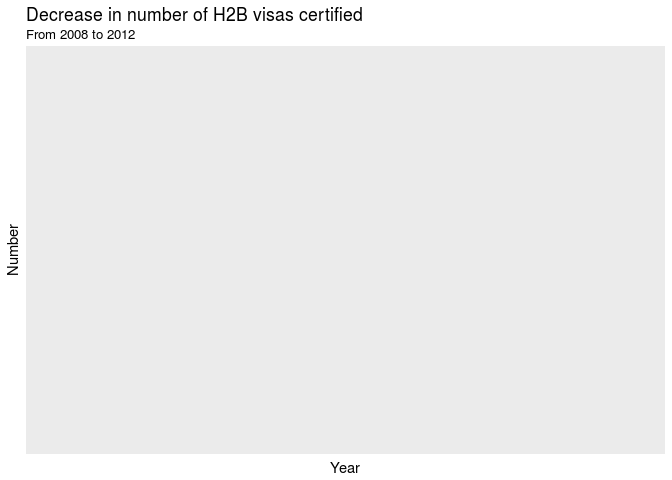

PROJECT TITLE
================
24-7
4-20-18

    ## Warning: running command 'timedatectl' had status 1

    ## ── Attaching packages ──────────────────────────────────────────────────────── tidyverse 1.2.1 ──

    ## ✔ ggplot2 2.2.1     ✔ purrr   0.2.4
    ## ✔ tibble  1.4.1     ✔ dplyr   0.7.4
    ## ✔ tidyr   0.7.2     ✔ stringr 1.2.0
    ## ✔ readr   1.1.1     ✔ forcats 0.2.0

    ## ── Conflicts ─────────────────────────────────────────────────────────── tidyverse_conflicts() ──
    ## ✖ dplyr::filter() masks stats::filter()
    ## ✖ dplyr::lag()    masks stats::lag()

    ## 
    ## Attaching package: 'lubridate'

    ## The following object is masked from 'package:base':
    ## 
    ##     date

    ## 
    ## Attaching package: 'maps'

    ## The following object is masked from 'package:purrr':
    ## 
    ##     map

### Background

### Data Manipulation

### Visualizations

In 2008, Congress failed to renew the Save Our Small and Seasonal Bussinesses Act (SOSSBA). This reduced the cap for the total number of H2B Visas that could be approved every year.

### Hypothesis Tests

### Regression Model

    ## Start:  AIC=-23509.82
    ## prop_workers_certified ~ occupation_category + prevailing_wage + 
    ##     submitted_season + region + nbur_workers_requested
    ## 
    ##                          Df Sum of Sq    RSS    AIC
    ## - nbur_workers_requested  1     0.000 1307.8 -23512
    ## <none>                                1307.8 -23510
    ## - prevailing_wage         1     2.308 1310.1 -23492
    ## - region                  3     4.173 1312.0 -23481
    ## - submitted_season        3    20.312 1328.1 -23346
    ## - occupation_category     8    34.324 1342.2 -23240
    ## 
    ## Step:  AIC=-23511.82
    ## prop_workers_certified ~ occupation_category + prevailing_wage + 
    ##     submitted_season + region
    ## 
    ##                       Df Sum of Sq    RSS    AIC
    ## <none>                             1307.8 -23512
    ## - prevailing_wage      1     2.310 1310.1 -23494
    ## - region               3     4.236 1312.1 -23482
    ## - submitted_season     3    20.316 1328.1 -23348
    ## - occupation_category  8    34.446 1342.3 -23241

    ## 
    ## Call:
    ## lm(formula = prop_workers_certified ~ occupation_category + prevailing_wage + 
    ##     submitted_season + region, data = h2b)
    ## 
    ## Coefficients:
    ##                                                (Intercept)  
    ##                                                  8.094e-01  
    ##                               occupation_categorybenchwork  
    ##                                                 -7.965e-02  
    ##                      occupation_categoryclerical and sales  
    ##                                                 -1.468e-01  
    ##                          occupation_categorymachine trades  
    ##                                                 -1.311e-01  
    ##                           occupation_categorymiscellaneous  
    ##                                                 -5.908e-02  
    ##                              occupation_categoryprocessing  
    ##                                                  4.236e-03  
    ## occupation_categoryprofessional, technical, and managerial  
    ##                                                 -1.746e-01  
    ##                                 occupation_categoryservice  
    ##                                                 -4.340e-02  
    ##                         occupation_categorystructural work  
    ##                                                 -1.537e-01  
    ##                                            prevailing_wage  
    ##                                                 -5.535e-06  
    ##                                     submitted_seasonspring  
    ##                                                 -3.485e-02  
    ##                                     submitted_seasonsummer  
    ##                                                 -2.241e-02  
    ##                                     submitted_seasonwinter  
    ##                                                  6.885e-02  
    ##                                            regionNortheast  
    ##                                                  4.408e-02  
    ##                                                regionSouth  
    ##                                                  6.584e-03  
    ##                                                 regionWest  
    ##                                                 -1.104e-02
