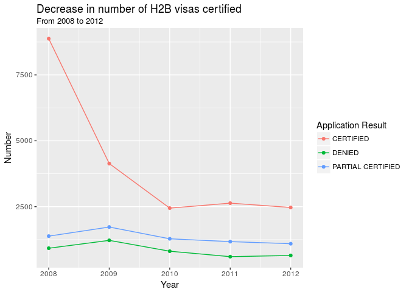

PROJECT TITLE
================
24-7
4-20-18

    ## ── Attaching packages ──────────────────────────────────────────────────── tidyverse 1.2.1 ──

    ## ✔ ggplot2 2.2.1     ✔ purrr   0.2.4
    ## ✔ tibble  1.4.2     ✔ dplyr   0.7.4
    ## ✔ tidyr   0.8.0     ✔ stringr 1.3.0
    ## ✔ readr   1.1.1     ✔ forcats 0.3.0

    ## ── Conflicts ─────────────────────────────────────────────────────── tidyverse_conflicts() ──
    ## ✖ dplyr::filter() masks stats::filter()
    ## ✖ dplyr::lag()    masks stats::lag()

    ## 
    ## Attaching package: 'lubridate'

    ## The following object is masked from 'package:base':
    ## 
    ##     date

    ## 
    ## Attaching package: 'maps'

    ## The following object is masked from 'package:purrr':
    ## 
    ##     map

### Background

### Data Manipulation

    ## # A tibble: 2,729 x 2
    ##    decision_date season
    ##    <chr>         <chr> 
    ##  1 3/3/08        spring
    ##  2 3/3/08        spring
    ##  3 3/3/08        spring
    ##  4 3/3/08        spring
    ##  5 3/3/08        spring
    ##  6 3/3/08        spring
    ##  7 3/3/08        spring
    ##  8 3/3/08        spring
    ##  9 3/3/08        spring
    ## 10 3/3/08        spring
    ## # ... with 2,719 more rows

### Visualizations

In 2008, Congress failed to renew the Save Our Small and Seasonal Bussinesses Act (SOSSBA). This reduced the cap for the total number of H2B Visas that could be approved every year.

### Hypothesis Tests

### Regression Model

    ## # A tibble: 5 x 2
    ##    fold     n
    ##   <dbl> <int>
    ## 1    1.  6285
    ## 2    2.  6285
    ## 3    3.  6284
    ## 4    4.  6284
    ## 5    5.  6284
