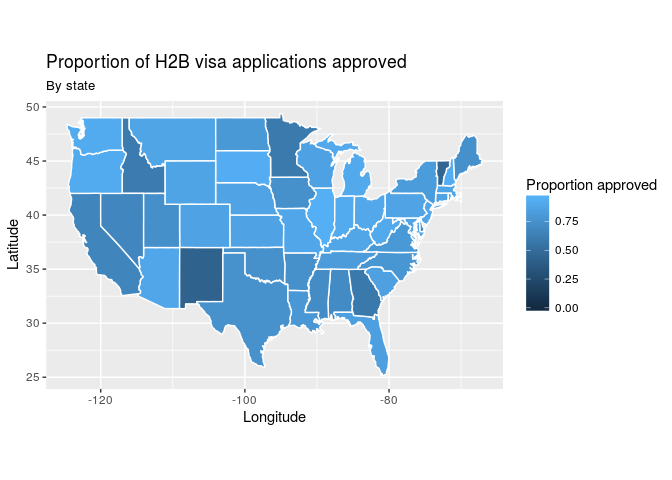

PROJECT TITLE
================
24-7
4-20-18

    ## Warning: running command 'timedatectl' had status 1

    ## ── Attaching packages ──────────────────────────────────────────────────────────── tidyverse 1.2.1 ──

    ## ✔ ggplot2 2.2.1     ✔ purrr   0.2.4
    ## ✔ tibble  1.4.1     ✔ dplyr   0.7.4
    ## ✔ tidyr   0.7.2     ✔ stringr 1.2.0
    ## ✔ readr   1.1.1     ✔ forcats 0.2.0

    ## ── Conflicts ─────────────────────────────────────────────────────────────── tidyverse_conflicts() ──
    ## ✖ dplyr::filter() masks stats::filter()
    ## ✖ dplyr::lag()    masks stats::lag()

### Background

### Data Manipulation

    ## Warning: Too few values at 8953 locations: 11173, 11174, 11175, 11176,
    ## 11177, 11178, 11179, 11180, 11181, 18268, 18269, 18270, 18271, 18272,
    ## 18273, 18274, 18275, 18276, 18277, 18278, ...

    ## Warning: Too few values at 8953 locations: 11173, 11174, 11175, 11176,
    ## 11177, 11178, 11179, 11180, 11181, 18268, 18269, 18270, 18271, 18272,
    ## 18273, 18274, 18275, 18276, 18277, 18278, ...

    ## Joining, by = c("case_no", "decision_date", "npc_submitted_date", "case_status", "alien_work_state", "certification_begin_date", "certification_end_date", "employer_city", "employer_state", "employer_postal_code", "agent_attorney_city", "agent_attorney_state", "job_title", "nbr_workers_certified", "prevailing_wage", "pw_unit_of_pay", "basic_rate_of_pay", "basic_unit_of_pay", "dot_occupational_code", "nbur_workers_requested", "dot_name", "soc_code", "soc_name", "wage_diff")
    ## Joining, by = c("case_no", "decision_date", "npc_submitted_date", "case_status", "alien_work_state", "certification_begin_date", "certification_end_date", "employer_city", "employer_state", "employer_postal_code", "agent_attorney_city", "agent_attorney_state", "job_title", "nbr_workers_certified", "prevailing_wage", "pw_unit_of_pay", "basic_rate_of_pay", "basic_unit_of_pay", "dot_occupational_code", "nbur_workers_requested", "dot_name", "soc_code", "soc_name", "wage_diff")

    ## Joining, by = c("case_no", "decision_date", "decision_month", "decision_day", "decision_year", "npc_submitted_date", "case_status", "alien_work_state", "certification_begin_date", "certification_end_date", "employer_city", "employer_state", "employer_postal_code", "agent_attorney_city", "agent_attorney_state", "job_title", "nbr_workers_certified", "prevailing_wage", "pw_unit_of_pay", "basic_rate_of_pay", "basic_unit_of_pay", "dot_occupational_code", "nbur_workers_requested", "dot_name", "soc_code", "soc_name", "wage_diff", "submitted_month", "submitted_day", "submitted_year")

### Visualizations

    ## 
    ## Attaching package: 'maps'

    ## The following object is masked from 'package:purrr':
    ## 
    ##     map

### Hypothesis Tests

### Regression Model

Your project goes here! Before you submit, make sure your chunks are turned off with `echo = FALSE`.

You can add sections as you see fit. Make sure you have a section called Introduction at the beginning and a section called Conclusion at the end. The rest is up to you!
