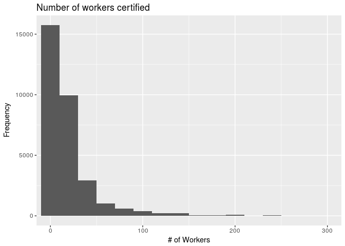
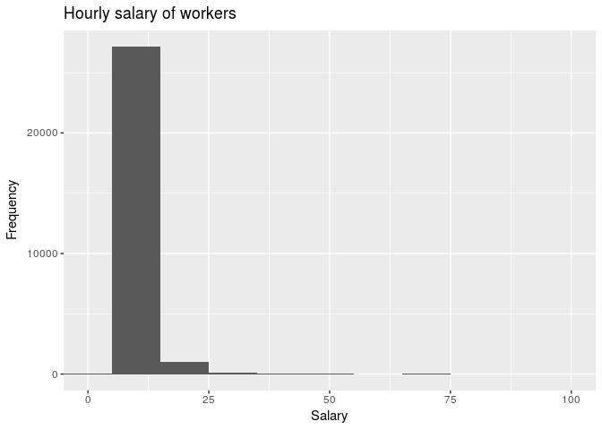

Analyzing H2B Data
================
24-7
3-26-18

    ## Warning: running command 'timedatectl' had status 1

Section 1. Introduction
-----------------------

Our general research question is: what factors make companies more likely to get successfully obtain H2-B visas?

For context, an H2-B visa is a temporary work visa for foreign workers with a job offer for seasonal, non-agricultural work in the United States. Employers from the United States must first submit temporary labor certification applications to the Department of Labor to allow H-2B workers to apply for visas. (Source: U.S. Citizenship and Immigration Services)

The dataset we are using is from the Department of Labor's Office of Foreign Labor Certification (OFLC). The data comes from H-2B applications that have been received and entered into the Department of Labor Tracking system. Specific information in the dataset about the employers was gathered through the foreign labor certification applications employers submitted. Data relating to wage levels was provided by the Bureau of Labor Statistics' Occupational Employment Statistics Program.

The data is sorted by fiscal year, from 2000 to 2013. Each observation is a different petition filed by an employer. The variables in the dataset are as follows: CASE\_NUMBER, DECISION\_DATE, NPC\_SUBMITTED\_DATE, CASE\_STATUS, VISA\_CLASS, ALIEN\_WORK\_STATE, CERTIFICATION\_BEGIN\_DATE, CERTIFICATION\_END\_DATE, EMPLOYER\_NAME, EMPLOYER\_ADDRESS1, EMPLOYER\_ADDRESS2, EMPLOYER\_CITY, EMPLOYER\_STATE, EMPLOYER\_POSTAL\_CODE, AGENT\_ATTORNEY\_NAME, AGENT\_ATTORNEY\_CITY, AGENT\_ATTORNEY\_STATE, SOC\_CODE, SOC\_NAME, JOB\_TITLE, NBR\_WORKERS\_CERTIFIED, PREVIALING\_WAGE (spelling error present in data), PW\_UNIT\_OF\_PAY, BASIC\_RATE\_OF\_PAY, BASIC\_UNIT\_OF\_PAY

Section 2. Data analysis plan
-----------------------------

Our outcome variable is whether an H-2B Visa certification request made by a company is successful. Our explanatory variables are the state in which the request was made, the type of work the request was made for, by DOT Code, the number of workers requested, the time of the year the request was made, and the salary for workers.

The comparison groups will include different states, which could be combined into regions, different occupations, such as agricultural or service, the seasons in which a request was made, the salary of the workers, and whether the workers are recieving benefits.

We will primarily use hypothesis testing to determine variable independence. In other words, we will use hypothesis tests to determine if there is a statistically significant difference in the proportion of Visa applicants that get accepted. We will also make a linear model to predict whether or not certain cases would or wouldn't be granted a Visa. In doing this, we will used Cross Validation to confirm that our model would be a good predictor in situations outside of our data.

    ## # A tibble: 5 x 8
    ##   CASE_STATUS         min    q1 median    q3  mean    sd    max
    ##   <chr>             <dbl> <dbl>  <dbl> <dbl> <dbl> <dbl>  <dbl>
    ## 1 CERTIFIED          5.85  7.90   8.66  9.86 11.4   26.3 575   
    ## 2 DENIED             0     8.00   9.28 12.5  12.4   26.3 900   
    ## 3 FINAL REVIEW      40.0  40.0   40.0  40.0  40.0   NA    40.0 
    ## 4 PARTIAL CERTIFIED  5.52  8.00   8.63  9.54  9.39  11.0 381   
    ## 5 WITHDRAWN          7.00  7.00   7.00  7.00  7.00  NA     7.00

Section 3. Data
---------------

    ## Observations: 31,422
    ## Variables: 21
    ## $ CASE_NO                  <chr> "A-07257-27842", "A-07261-27932", "C-...
    ## $ DECISION_DATE            <chr> "10/1/07", "10/1/07", "10/1/07", "10/...
    ## $ NPC_SUBMITTED_DATE       <chr> "9/13/07", "9/18/07", "9/28/07", "9/2...
    ## $ CASE_STATUS              <chr> "CERTIFIED", "CERTIFIED", "PARTIAL CE...
    ## $ ALIEN_WORK_STATE         <chr> "FL", "PA", "MN", "TX", "CA", "CO", "...
    ## $ CERTIFICATION_BEGIN_DATE <chr> "11/1/07", "12/1/07", "12/1/07", "12/...
    ## $ CERTIFICATION_END_DATE   <chr> "4/30/08", "9/1/08", "3/30/08", "11/1...
    ## $ EMPLOYER_CITY            <chr> "LEWISVILLE", "ALLISON", "ST. LOUIS",...
    ## $ EMPLOYER_STATE           <chr> "PA", "PA", "MN", "OK", "NV", "CO", "...
    ## $ EMPLOYER_POSTAL_CODE     <chr> "19351", "15101", "55416", "74743", "...
    ## $ AGENT_ATTORNEY_CITY      <chr> "WEST CHESTER", NA, "BAY CITY", "HUGO...
    ## $ AGENT_ATTORNEY_STATE     <chr> "PA", NA, "TX", "OK", "TX", NA, "TX",...
    ## $ JOB_TITLE                <chr> "STABLE ATTENDANT", "FARMWORKER, LIVE...
    ## $ NBR_WORKERS_CERTIFIED    <int> 15, 3, 50, 300, 50, 5, 11, 1, 30, 3, ...
    ## $ BASIC_RATE_OF_PAY        <dbl> 8.73, 7.72, 9.01, 7.74, 7.58, 8.16, 8...
    ## $ BASIC_UNIT_OF_PAY        <chr> "HR", "HR", "HR", "HR", "HR", "HR", "...
    ## $ DOT_OCCUPATIONAL_CODE    <chr> NA, NA, NA, NA, NA, NA, NA, NA, NA, N...
    ## $ NBR_WORKERS_REQUESTED    <int> NA, NA, NA, NA, NA, NA, NA, NA, NA, N...
    ## $ DOT_NAME                 <chr> NA, NA, NA, NA, NA, NA, NA, NA, NA, N...
    ## $ SOC_CODE                 <int> NA, NA, NA, NA, NA, NA, NA, NA, NA, N...
    ## $ SOC_NAME                 <chr> NA, NA, NA, NA, NA, NA, NA, NA, NA, N...
